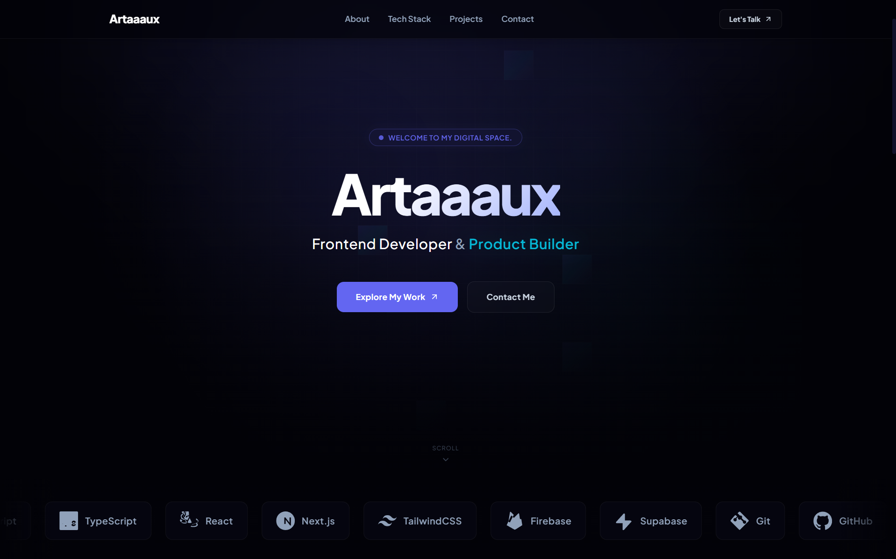

# 🚀 Artaaaux Portfolio

A premium personal portfolio built with modern web technologies, showcasing projects, skills, and passion for building digital products.


---

## ✨ Overview

This portfolio was designed to deliver a premium and modern experience while showcasing my work as a developer.

The website focuses on:

* 🎨 Modern UI/UX
* ⚡ High Performance
* 📱 Fully Responsive Design
* ✨ Smooth Animations
* 🚀 Production-Ready Architecture

---

## 🌐 Live Demo

🔗 https://artaaaaux.vercel.app

---

## 🛠️ Tech Stack

### Frontend

* Next.js
* TypeScript
* React
* Tailwind CSS

### Animation

* Framer Motion
* Lenis Smooth Scroll

### UI

* Aceternity UI
* Magic UI
* Lucide Icons

### Deployment

* Vercel

---

## 📂 Featured Projects

### 💰 FINUSA

Financial platform project focused on delivering a modern and intuitive user experience.

🔗 https://finusa.vercel.app

---

### 🏫 Website OSIS

Official student organization website built with a modern responsive design.

🔗 https://osis.shabi.web.id

---

## 📸 Preview

Add screenshots here after deployment.





---

## 🚀 Getting Started

Clone the repository:

```bash
git clone https://github.com/Artaaaaux/Portfolio.git
```

Install dependencies:

```bash
npm install
```

Run development server:

```bash
npm run dev
```

Build production:

```bash
npm run build
```

---

## 👨‍💻 Contact


📧 Email

[azadirachta.perwira@gmail.com](mailto:azadirachta.perwira@gmail.com)


🐙 GitHub

https://github.com/Artaaaaux


 Discord

Username: artaaaaux


---

## ⭐ Support

If you like this project, consider giving it a star.

---

Made with ❤️ by Artaaaux
